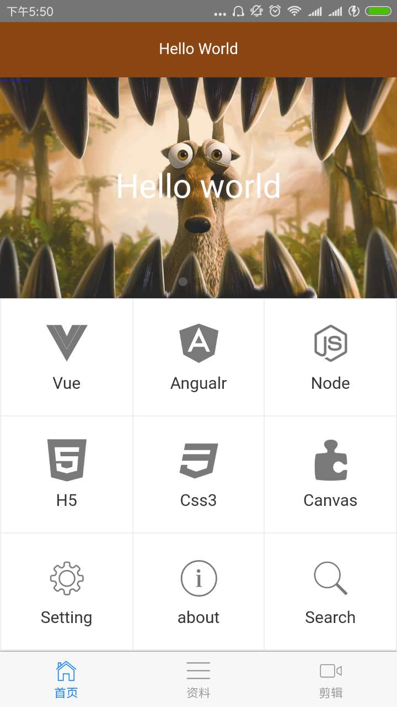
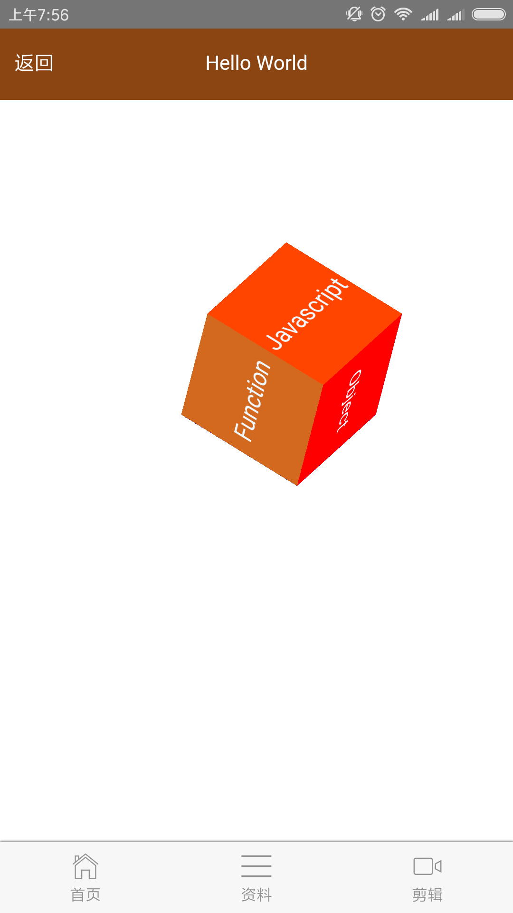
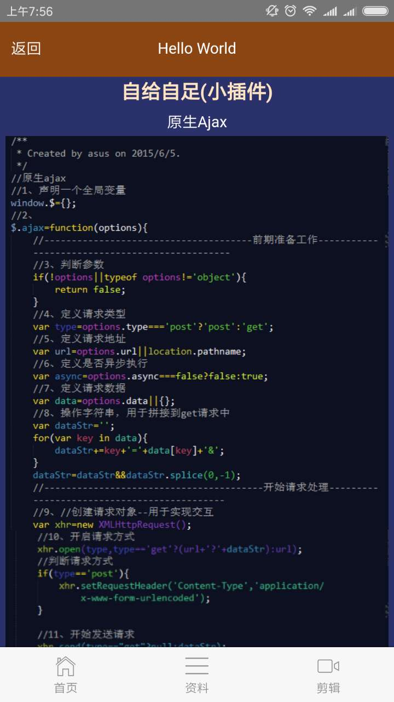

# Hello World 说明

## 目的

+ 这个App是为了前端学习，现在还没有完善，希望大家一起努力，来完善这个作品。

## 技术栈
+ 基于node环境
+ 通过webpack打包
+ 利用vue2.0来完善项目
+ 通过npm下载所需组件加载器
## 项目模块
+ home模块是展示各个技术类

  

+ 资料模块是集成各个技术团队的官网，和一些名人博客

 

+ 剪辑模块是我的个人爱好(通过会声会影剪辑一些视频)
 

### home模块中的搜索我通过ifame内嵌的百度
 

### 我们还可以加一些其他功能，比如
+ css3动画
 
+ 插件源码
 
